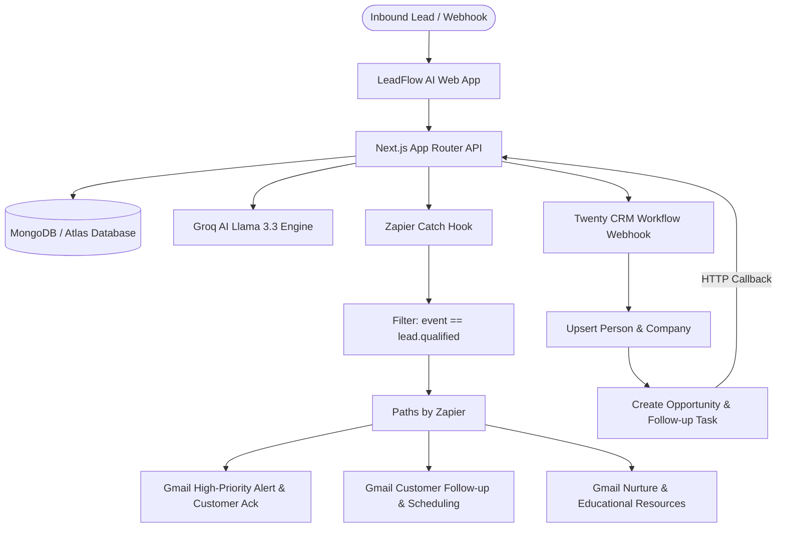

# LeadFlow AI — Intelligent CRM & Sales Automation Platform

[](https://github.com/leadflow-ai/leadflow-ai/actions)


LeadFlow AI is an enterprise-grade B2B sales operations platform. It autonomously captures incoming prospects, eliminates duplicates, performs real-time AI qualification using Groq Llama 3.3, synchronizes CRM records to **Twenty CRM**, and triggers multi-channel routing (Gmail, Tasks, Deals) through **Zapier**.

---

## Architecture Flow



---

## Key Features

1. **Light Beige Enterprise Design System:** High-contrast editorial clarity (WCAG AA+ compliant, 13.8:1 contrast) with subtle warm tones, avoiding sterile clinical white or neon themes.
2. **Deterministic & LLM Qualification:** Combines Groq Llama 3.3 structured JSON scoring with deterministic priority calculation:
   - **HIGH:** 80–100
   - **MEDIUM:** 50–79
   - **LOW:** 0–49
3. **Mandatory Duplicate Prevention:** Normalized email indexing with automated record updating instead of pipeline duplication.
4. **Twenty CRM Native Workflow:** Direct backend dispatch to Twenty CRM Workflow Webhook for automatic upserting of Person and Company, opportunity generation, task scheduling, and secure HTTP callback.
5. **Hardened Zapier Webhooks:** Outbound triggers with cryptographically unique event IDs, 3-path conditional branching (HIGH, MEDIUM, LOW), and Gmail automation.
6. **Visual Operational Dashboard:** 10 live production KPIs (Total Leads, New Leads, Qualified Leads, High Priority, Medium Priority, Low Priority, Open Opportunities, Pending Tasks, Automation Runs, Success Rate), pipeline charts, and immutable audit logs.
7. **Interactive Kanban & Table Pipeline:** Dual-view deal tracking across 7 stages with quick stage-progression selectors.
8. **Automated Pipeline Monitoring:** Step-by-step visual execution timelines displaying latency, status, and payload summaries.

---

## Technology Stack

- **Framework:** Next.js 15 (App Router, Server Actions, Route Handlers)
- **Frontend:** React 19, TypeScript (Strict), Tailwind CSS v4, Lucide Icons
- **Persistence:** MongoDB with Mongoose (Indexed models, compound queries)
- **AI Engine:** Groq Cloud SDK (`llama-3.3-70b-versatile`) with Zod schema parsing
- **CRM Layer:** Twenty CRM Workflow & REST API adapter
- **Automation:** Zapier Outbound Catch Hooks & Gmail Integration
- **Testing:** Vitest for unit & integration test suites
- **CI/CD & Deployment:** GitHub Actions CI, Dockerfile, Vercel & Render configs

---

## Project Structure

```text
LeadFlow AI/
├── app/
│   ├── (auth)/login & register/   # Authentication views
│   ├── (marketing)/ & legal/      # Landing page, privacy, terms
│   ├── dashboard/                 # 10 production KPIs & pipeline charts
│   ├── leads/ & leads/[id]/       # Lead management, AI insights & retry
│   ├── companies/                 # Company accounts & relations
│   ├── opportunities/             # Deals table & Kanban board
│   ├── tasks/                     # Task management & filters
│   ├── automations/               # Workflow monitoring & timelines
│   ├── activity/                  # Platform audit log
│   ├── integrations/              # Connection health (MongoDB, Groq, Twenty, Zapier, Gmail)
│   ├── settings/                  # Webhook URL copy & workspace config
│   └── api/                       # Typed Next.js Route Handlers
├── components/
│   ├── ui/                        # Button, Input, Modal, Badge, ScoreBadge...
│   └── layout/                    # AppShell, Sidebar, Topbar
├── lib/
│   ├── auth/                      # Password bcrypt & JWT cookie sessions
│   ├── db/                        # Mongoose connection pooling
│   ├── env/                       # Zod environment validation
│   ├── logging/                   # Redacted structured JSON logger
│   ├── scoring/                   # Deterministic weighted priority engine
│   ├── security/                  # Rate limiting & webhook deduplication
│   └── integrations/
│       ├── twenty/                # Twenty CRM client, mapper, types
│       ├── zapier/                # Outbound Catch Hook client, mapper, types
│       └── email/                 # Gmail & email notifications
├── models/                        # User, Lead, Company, Opportunity, Task, etc.
├── prompts/                       # Versioned AI prompt architectures
├── design-system/                 # MASTER.md & page specifications
├── scripts/                       # Seed script for realistic demo data
├── tests/                         # Vitest unit test suites
├── docs/                          # Architecture, API, Security, Deployment specs
└── .github/workflows/             # GitHub Actions CI pipeline
```

---

## Quickstart & Local Development

### 1. Clone & Install Dependencies

```bash
git clone <your-repo-url> "LeadFlow AI"
cd "LeadFlow AI"
npm install
```

### 2. Configure Environment

Copy the example environment configuration:

```bash
cp .env.example .env.local
```

*(In mock mode, the app runs completely without external keys).*

### 3. Authentication & Workspace Setup

LeadFlow AI utilizes **Google OAuth 2.0** for secure, multi-tenant workspace isolation.

- Simply start the application and click **"Continue with Google"** on the `/login` screen.
- On first sign-in, your authenticated User profile and private Workspace are automatically provisioned.
- For optional local CLI data seeding during development: `npm run seed`

### 4. Start Development Server

```bash
npm run dev
```

Open [http://localhost:3000](http://localhost:3000).

---

## Testing & Quality Assurance

```bash
# Run Vitest test suites
npm run test

# Run strict TypeScript validation
npm run typecheck

# Build optimized production bundle
npm run build
```

---

## Master Zapier & Twenty Documentation

- **Zapier AI Master Prompt:** [docs/automation/ZAPIER_AI_MASTER_PROMPT.md](docs/automation/ZAPIER_AI_MASTER_PROMPT.md)
- **Twenty CRM Setup Guide:** [docs/automation/TWENTY_SETUP.md](docs/automation/TWENTY_SETUP.md)
- **Zapier Manual Setup Guide:** [docs/automation/ZAPIER_MANUAL_SETUP.md](docs/automation/ZAPIER_MANUAL_SETUP.md)
- **Webhook Contracts:** [docs/automation/WEBHOOK_CONTRACTS.md](docs/automation/WEBHOOK_CONTRACTS.md)
- **End-to-End Walkthrough Script:** [docs/automation/END_TO_END_DEMO.md](docs/automation/END_TO_END_DEMO.md)
- **Deployment Guide (Vercel & Render):** [docs/DEPLOYMENT.md](docs/DEPLOYMENT.md)
