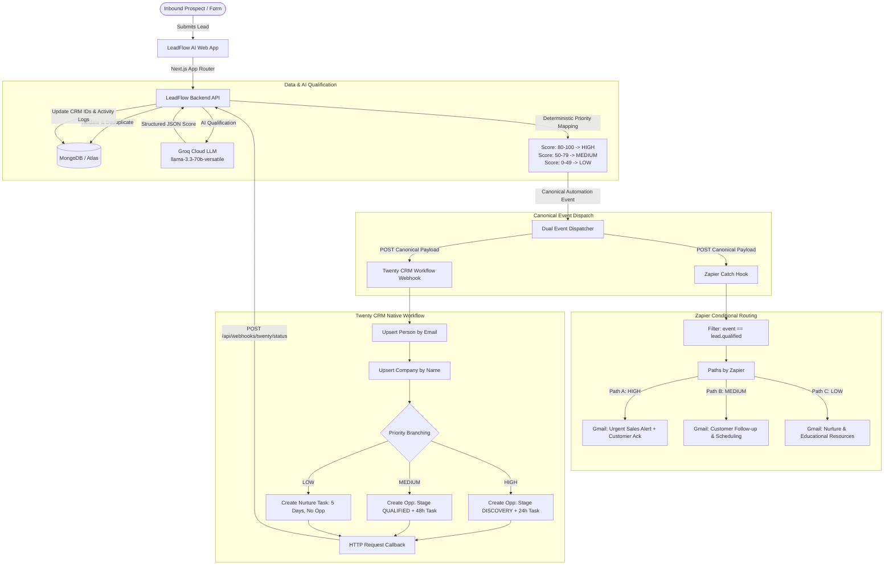
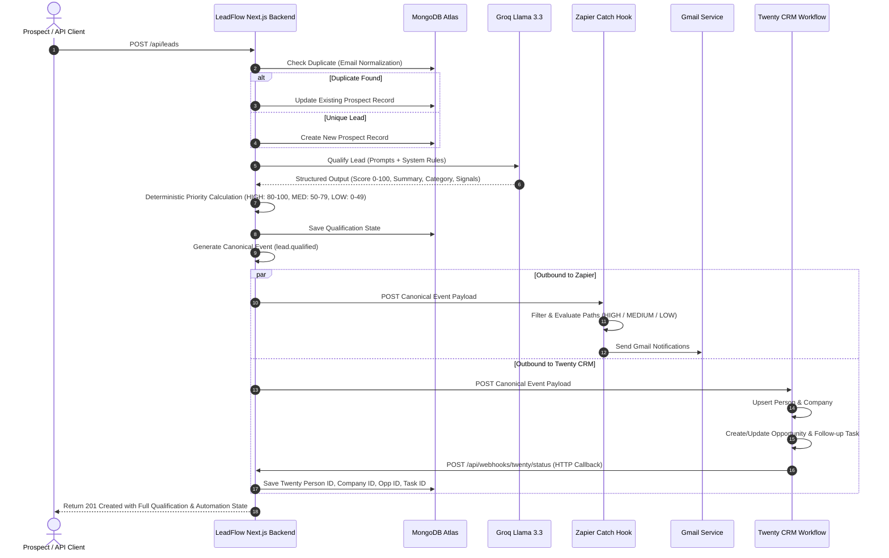

# LeadFlow AI — Architecture & System Design

**Platform:** LeadFlow AI — Intelligent CRM & Sales Automation Platform  
**Target Architecture:** Next.js Full-Stack App Router + MongoDB Atlas + Groq AI + Twenty CRM Workflow + Zapier Paths & Gmail Automation

---

## 1. High-Level Architecture Overview

LeadFlow AI serves as the centralized sales control center and intelligence layer. It captures inbound leads, performs duplicate checks and persistence in MongoDB, qualifies prospects via Groq Llama 3.3 with deterministic priority classification, and simultaneously dispatches a single normalized canonical automation event to **Zapier** and **Twenty CRM**.

---

## 2. Inbound Lead Processing & Lifecycle Sequence

---

## 3. Strict Separation of Responsibilities

To avoid duplicate records, split-brain states, and conflicting priorities:

1. **LeadFlow AI Backend owns:**
   - User authentication and authorization.
   - Core data persistence and validation.
   - Groq AI prompt execution and response schema validation.
   - Deterministic final priority calculation (`HIGH`, `MEDIUM`, `LOW`).
   - Unique event generation and audit log tracking.
   - Targeted manual retry triggers.

2. **Zapier owns:**
   - Multi-path conditional routing based on the authoritative `priority` field.
   - Gmail communications (Internal sales alerts, customer confirmations, follow-up emails, nurture emails).
   - *(Note: Zapier does NOT perform CRM record upsert, ensuring zero duplication).*

3. **Twenty CRM owns:**
   - CRM entity management (`Person`, `Company`, `Opportunity`, `Task`).
   - Pipeline stages and sales task due date calculations.
   - Final status confirmation via secure HTTP webhook callback.

---

## 4. Webhook Idempotency & Replay Protection

1. Every outbound event payload carries a unique `eventId` (`evt_<timestamp>_<hash>`).
2. Both Zapier and Twenty retain this `eventId` during all execution steps.
3. Inbound callbacks to `POST /api/webhooks/twenty/status` require:
   - `x-webhook-secret: <WEBHOOK_SECRET>` header.
   - Validated JSON payload conforming to `twentyStatusWebhookSchema`.
4. The backend checks `ProcessedWebhookEvent` in MongoDB before processing. If an `eventId` has already been recorded, the request returns HTTP 200 with status `IGNORED_DUPLICATE` to ensure idempotency.
